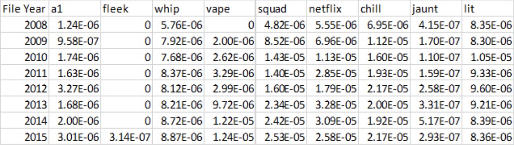
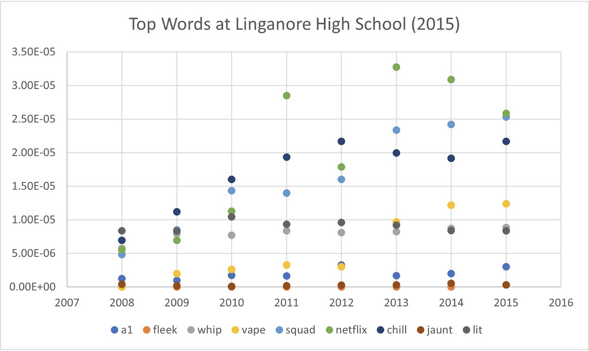

# PQHeap
 Finding word trends in Reddit comment files using a Priority Queue Heap

## Project Overview  
In this project, we used a priority queue max heap to track the most commonly used words in Reddit comments over the course of 8 years. To do this, we implemented the priority queue with an array. A priority queue max heap can be thought of (graphically) as a tree, where the top or root node has the maximum value, and each subsequent child node below the parent node is of a lesser value. This makes the tree self balancing and easy to identify the top most used words over a given file or time period.

## Results:

In order to test the Reddit files for common word trends throughout the years, I tried to find words that were popular among teenagers in 2015 to see if the occurrence of the words increased over the years. I began by researching what slang was used in 2015, and came upon a high school website that listed the most popular words among the students for that year. I then iterated through each of the Reddit files, and used the WordTrendsFinder class to see how many times the words appeared in each of the years. I allowed the program to take a generic file name as the first argument, the starting and ending years for the second and third arguments, and each subsequent argument after was a word to search for. The results can be seen below, where each word has its frequency displayed as compared to the number of unique words in the file:

The words’ occurrences are displayed through the frequency of the word as compared to the entire Reddit file. Because these words only yielded total maximum counts in the mid 1000s, the frequencies are rather miniscule because the files contain millions of unique words. Nevertheless, it is interesting to note that almost none of the words have the most occurrences in 2015. This is most likely due to the fact that Reddit is composed of users from many different age groups and locations, whereas the high school data was restricted to a single age group and geographic region.

